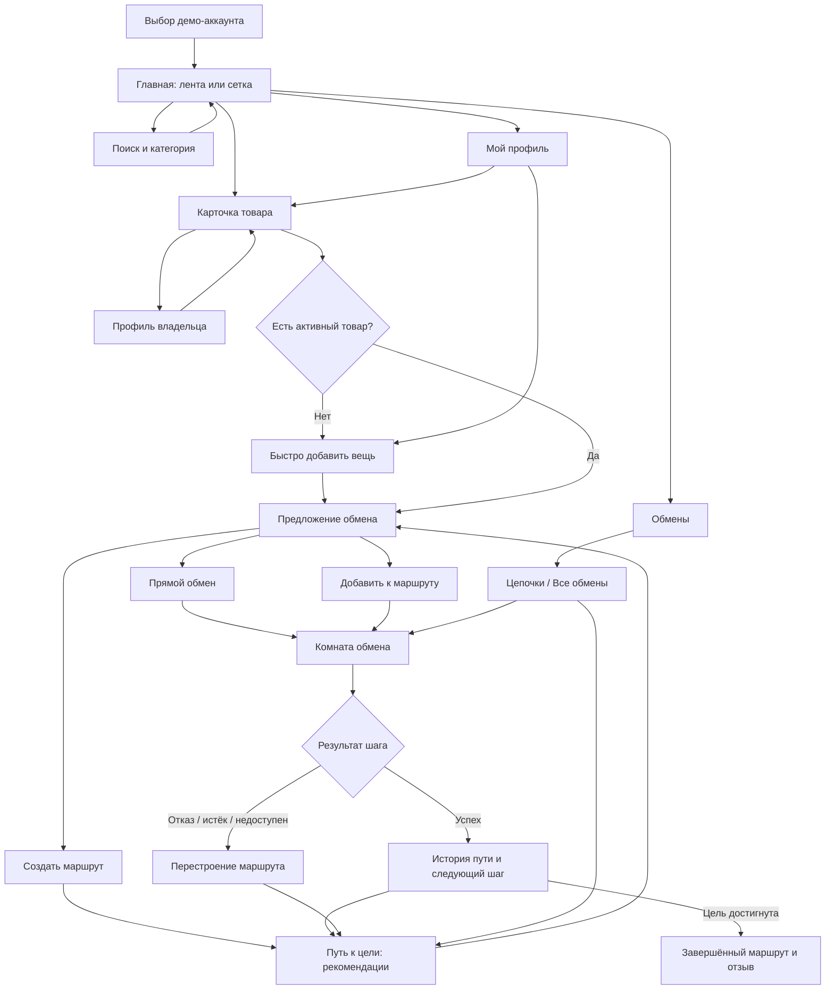

# Пользовательский сценарий MVP «Цепочка обмена»

## Содержание

1. [Цель сценария](#1-цель-сценария)
2. [Основные продуктовые решения](#2-основные-продуктовые-решения)
   - [Пользователь начинает с интереса](#21-пользователь-начинает-с-интереса-а-не-с-формы)
   - [Лента и сетка](#22-два-равноправных-представления-каталога)
   - [Быстрое описание вещи](#23-свободное-описание--короткий-интерфейс-существующего-создания-товара)
   - [Визуализация цепочки](#24-та-же-цепочка-показывается-в-двух-контекстах)
3. [Пять демо-аккаунтов](#3-пять-демо-аккаунтов)
4. [Основной пользовательский сценарий](#4-основной-пользовательский-сценарий)
   - [Выбор аккаунта](#шаг-1-выбор-аккаунта)
   - [Просмотр главной](#шаг-2-просмотр-главной)
   - [Интерес к товару](#шаг-3-интерес-к-товару)
   - [Выбор своего товара](#шаг-4-выбор-того-что-пользователь-отдаёт)
   - [Прямой обмен](#шаг-5а-прямой-обмен)
   - [Обмен в существующем маршруте](#шаг-5б-обмен-в-рамках-существующего-маршрута)
   - [Создание маршрута](#шаг-5в-новый-маршрут)
   - [Ответ второй стороны](#шаг-6-ответ-второй-стороны)
   - [Проведение обмена](#шаг-7-проведение-обмена)
   - [Продолжение маршрута](#шаг-8-продолжение-маршрута)
5. [Альтернативные и ошибочные сценарии](#5-альтернативные-и-ошибочные-сценарии)
6. [Карта страниц и переходов](#6-карта-страниц-и-переходов)
7. [Навигация приложения](#7-нижняя-навигация-и-desktop-навигация)
8. [Что уже реализовано](#8-что-уже-реализовано)
9. [Уязвимые места пользовательского сценария](#9-уязвимые-места-пользовательского-сценария)
10. [Безопасность и доверие](#10-безопасность-и-доверие)
11. [Приоритеты реализации](#11-приоритеты-реализации)
12. [Сценарий демонстрации жюри](#12-сценарий-демонстрации-жюри)

## 1. Цель сценария

Пользователь не обязан заранее знать точный товар и находить идеальный прямой обмен. Он может:

1. найти интересную вещь в общей ленте или каталоге;
2. предложить одну из своих вещей либо быстро описать новую;
3. начать прямой обмен или привязать предложение к маршруту до желаемой цели;
4. видеть текущий шаг, историю, результат и требуемое от него действие;
5. продолжить путь к цели, даже если отдельное предложение отклонено.

Ключевая формулировка MVP:

> Сервис строит персональный маршрут к желаемой вещи из безопасных двусторонних обменов. Если один шаг не состоялся, уже пройденные шаги и цель сохраняются, а маршрут пересчитывается.

### Ограничение задачи

Логика обменов остаётся такой, как реализована сейчас: те же сущности, статусы, правила согласования, подтверждение результата и алгоритм подбора. Меняются только визуализация, точки входа и переходы между существующими сценариями.

Новая лента не создаёт отдельную механику обмена. Кнопки из ленты открывают те же действия, которые уже доступны из карточки товара, страницы обменов и страницы маршрута.

Это ограничение не распространяется на две вещи, которые физически не существуют в системе сегодня и требуют небольшой, но настоящей серверной работы, а не только вёрстки: вход по одному из пяти демо-аккаунтов с воспроизводимым сбросом состояния (раздел 3) и передачу `exchange_goal_id`/`route_step_id` из формы предложения при работе внутри маршрута (см. [9.8](#98-предложение-из-маршрута-может-создать-не-связанную-с-ним-цепочку)). Само API для второго пункта уже есть — не хватает только вызова с фронтенда.

## 2. Основные продуктовые решения

### 2.1. Пользователь начинает с интереса, а не с формы

Главный вход в сценарий — просмотр вещей. Пользователь сначала замечает интересный товар, а затем решает, что готов предложить. Это снимает требование заранее сформулировать точную цель и заранее создать объявление.

### 2.2. Два равноправных представления каталога

- **Сетка** — быстрый обзор большого числа объявлений, поиск и фильтрация.
- **Лента** — последовательный просмотр одной вещи за раз с быстрым действием «Предложить обмен».

Переключатель «Лента / Сетка» расположен на главной и сохраняет последний выбор пользователя.

Лента использует знакомую механику коротких видео, но предметом является товар:

- на мобильном товар занимает экран, действия закреплены снизу или справа;
- на desktop слева находится крупное фото/видео товара, справа — название, описание, владелец, желаемый обмен и действия;
- свайп или скролл переключает товары;
- явные кнопки остаются обязательными: жест не должен одновременно означать пропуск, лайк или обмен.

Для MVP видео необязательно: текущая модель данных содержит изображение, поэтому полноэкранная фотолента уже проверяет гипотезу формата. Видео можно добавить позже.

### 2.3. Свободное описание — короткий интерфейс существующего создания товара

Чтобы не менять логику обмена, вариант «Описать вещь» не создаёт новый тип предложения. Это сокращённая визуальная версия существующего создания товара.

Поэтому кнопка «Описать вещь» открывает сокращённое создание товара:

- название или короткое описание — обязательно;
- категория — обязательно (продуктовое решение: без категории алгоритм подбора маршрута не сможет предложить следующий шаг, хотя в API поле не обязательно);
- фотография — опционально, одна штука (в текущей модели товара поле `image` хранит один файл, а не массив);
- комментарий владельцу — опционально; состояние вещи описывается тем же текстом, отдельного структурированного поля «состояние» в модели товара нет.

После сохранения создаётся обычная карточка товара, затем открывается существующее предложение обмена, а пользователь возвращается к выбранной цели. Внешне это один короткий сценарий, а логика и данные остаются прежними.

### 2.4. Та же цепочка показывается в двух контекстах

Существующая цепочка не меняется. В интерфейсе она показывается:

- кратко — как контекст действия в ленте и карточке товара;
- подробно — как «Путь к цели» во вкладке «Обмены».

Подробное представление объясняет:

- цель маршрута;
- что сейчас находится у пользователя;
- следующий рекомендуемый обмен;
- сколько шагов ориентировочно осталось;
- выполненные шаги;
- активные и отклонённые предложения;
- что требуется от пользователя сейчас.

## 3. Пять демо-аккаунтов

Первый экран MVP — не обычная форма email/пароля, а выбор демонстрационного профиля. На каждой карточке заранее показано, что можно проверить в этом аккаунте.

| Аккаунт | Подготовленное состояние | Какой сценарий показывает |
| --- | --- | --- |
| Новый пользователь | Нет товаров и обменов | Быстрое добавление вещи из карточки чужого товара |
| Искатель | 1–2 активных товара, обменов нет | Поиск цели, прямое предложение, создание маршрута |
| Получатель | Есть входящее предложение | Принятие или отказ, переход в комнату обмена |
| В пути | Есть текущий товар, выполненный шаг и активная цель | Продолжение маршрута и выбор промежуточного обмена |
| Опытный участник | Завершённый и несостоявшийся обмен, рейтинг | История, подтверждение результата, отзыв и восстановление после отказа |

После выбора профиль авторизуется автоматически и открывает главную. Для жюри нужен быстрый возврат к выбору аккаунта и сброс демо-данных. Иначе несколько проверяющих могут разрушить подготовленные состояния.

## 4. Основной пользовательский сценарий

### Шаг 1. Выбор аккаунта

Пользователь открывает приложение, выбирает один из пяти профилей и видит короткое пояснение его состояния. После входа попадает на главную страницу.

**Система должна сохранить:** выбранный профиль, исходную страницу и выбранный режим каталога.

### Шаг 2. Просмотр главной

На главной доступны:

- переключатель «Лента / Сетка»;
- поиск по названию и описанию;
- фильтр по категории;
- карточка товара;
- переход в профиль владельца;
- основное действие «Предложить обмен»;
- вторичное действие «Открыть товар».

Пользователь может смотреть общую выдачу без заранее выбранной цели. Поиск и категория меняют одну и ту же выдачу, а выбранный режим отображения не сбрасывается.

### Шаг 3. Интерес к товару

В ленте пользователь нажимает «Предложить обмен». В сетке он сначала открывает карточку товара, где видит:

- фото (одно), описание, категорию и город; состояние вещи — часть текста описания, отдельного поля под него в модели данных нет;
- ориентир стоимости или условия доплаты;
- что владелец хотел бы получить;
- имя, рейтинг, количество завершённых обменов и ссылку на профиль;
- действия «Предложить обмен» и «Найти путь к этой вещи».

Если пользователь не авторизован, после входа он возвращается к этому же товару и продолжает действие.

### Шаг 4. Выбор того, что пользователь отдаёт

Если есть активные товары, открывается компактный список:

- выбрать один из своих товаров;
- добавить комментарий владельцу;
- отправить прямое предложение;
- привязать предложение к существующему маршруту;
- создать новый маршрут с этим товаром как целью.

Если активных товаров нет, показывается не тупик, а два действия:

1. **Быстро добавить вещь** — короткая форма прямо в текущем контексте;
2. **Создать полное объявление** — переход на полную форму с сохранением выбранной цели.

После создания товара пользователь возвращается в окно предложения. Выбирать целевой товар заново не требуется.

### Шаг 5А. Прямой обмен

Если выбран конкретный собственный товар, пользователь проверяет итог:

> Вы отдаёте: «Велосипед»  
> Вы хотите получить: «Игровая приставка»  
> Владелец получит ваше предложение и ответит до указанного срока.

После отправки открывается комната обмена. Предложение также появляется во вкладке «Обмены → Исходящие».

### Шаг 5Б. Обмен в рамках существующего маршрута

Пользователь выбирает маршрут из списка. В карточке маршрута показаны цель и текущий товар, чтобы исключить ошибочную привязку.

После отправки система сохраняет связь предложения с:

- конечной целью;
- текущим шагом;
- предыдущим завершённым шагом;
- выбранным промежуточным товаром.

Предложение появляется в истории маршрута и в общем списке обменов.

### Шаг 5В. Новый маршрут

Пользователь выбирает:

- что у него есть сейчас;
- конкретный желаемый товар или категорию цели.

Система показывает следующий доступный шаг. Если возможны несколько вариантов, они ранжируются и объясняются: количество шагов, город, разница стоимости и соответствие пожеланиям владельцев.

### Шаг 6. Ответ второй стороны

Владелец целевого или промежуточного товара открывает входящее предложение и видит симметричное резюме:

- что он отдаёт;
- что получает;
- условия и возможную доплату;
- профиль второй стороны;
- срок ответа;
- действия «Принять», «Отклонить», «Предложить другие условия».

После принятия обе стороны переходят к согласованию встречи в комнате обмена.

### Шаг 7. Проведение обмена

Комната обмена содержит:

- два товара и обе стороны;
- текущий статус человеческим языком;
- блок «От вас требуется»;
- чат;
- условия и доплату;
- срок действия предложения;
- подтверждение результата каждой стороной;
- правила безопасной встречи.

Статусы не должны быть самостоятельной информацией. Каждый статус переводится в действие:

| Состояние | Что видит пользователь |
| --- | --- |
| Ожидает ответа | «Владелец должен ответить до …» |
| Принято | «Согласуйте место и время встречи» |
| Ждёт подтверждения | «Подтвердите, состоялся ли обмен» |
| Подтверждено одной стороной | «Ждём подтверждения второго участника» |
| Завершено | «Обмен завершён. Оставьте отзыв» |
| Отклонено / истекло | «Предложение закрыто. Подобрать другой вариант» |
| Товар недоступен | «Товар ушёл в другой обмен. Перестроить маршрут» |

### Шаг 8. Продолжение маршрута

После успешного шага:

1. полученный товар становится текущим товаром пользователя;
2. завершённый обмен добавляется в историю пути;
3. система пересчитывает следующий шаг к сохранённой цели;
4. пользователь получает новые рекомендации;
5. после последнего шага маршрут помечается завершённым.

## 5. Альтернативные и ошибочные сценарии

### Прямой обмен найден

Маршрут состоит из одного шага. Пользователь не должен проходить отдельный конструктор цепочки.

### Подходящего пути пока нет

Система сохраняет цель и показывает понятный результат: «Сейчас подходящих вариантов нет». Доступны действия «Изменить цель», «Посмотреть похожие товары» и «Сообщить, когда появится путь».

### Участник отказался

Закрывается только текущее предложение. Цель, текущий товар и пройденная история остаются. Пользователь получает действие «Подобрать другой вариант».

### Товар не подошёл при встрече

Любая сторона отмечает обмен несостоявшимся и выбирает причину. Владение товарами не меняется. Маршрут возвращается к подбору с тем же текущим товаром.

### Товар стал недоступен

Активный шаг закрывается как недоступный, пользователь получает объяснение и новый подбор. Нельзя оставлять карточку в вечном ожидании.

### Один товар участвует в нескольких предложениях

Интерфейс показывает все связанные предложения и их текущие статусы. После завершения одного обмена конкурирующие предложения отображаются как закрытые или недоступные — в соответствии с уже реализованной логикой. Новых правил резервирования в рамках редизайна не вводится.

### Пользователь участвует в нескольких маршрутах

Каждый маршрут отображается отдельной карточкой с целью, текущим товаром и числом активных предложений. Правила одновременного участия остаются такими же, как сейчас.

### Участник не отвечает

Предложение имеет срок действия. Перед истечением приходит напоминание, после истечения маршрут можно пересчитать.

## 6. Карта страниц и переходов

## 7. Нижняя навигация и desktop-навигация

Для MVP достаточно четырёх разделов:

1. **Главная** — лента или сетка, поиск и категории;
2. **Обмены** — цепочки и отдельные входящие/исходящие обмены;
3. **Добавить** — создание товара;
4. **Профиль** — товары пользователя, рейтинг, история и смена демо-аккаунта.

Уведомления открываются из колокольчика и ведут сразу в нужную комнату обмена или маршрут.

## 8. Что уже реализовано

| Возможность | Состояние сейчас | Что нужно для нового сценария |
| --- | --- | --- |
| Каталог-сетка | Реализован | Добавить переключатель режима и сохранить выбор |
| Поиск и категория | Реализованы | Использовать в обеих версиях выдачи |
| Вертикальная лента | Нет | Новый режим представления тех же товаров |
| Карточка товара | Реализована | Усилить CTA и кратко объяснить путь к цели |
| Профиль владельца | Реализован | Явнее показать доверие и завершённые обмены |
| Создание и редактирование товара | Реализовано | Добавить сокращённый сценарий с возвратом к цели |
| Прямое предложение обмена | Реализовано только с существующим активным товаром | Убрать тупик для пустого профиля |
| Быстрое описание вещи | Отдельного интерфейса нет | Показать сокращённую форму существующего создания товара, затем открыть обычное предложение |
| Привязка нового предложения к уже существующему маршруту (Шаг 5Б) | Не реализовано на фронте: форма предложения (`OfferExchangeModal`) всегда создаёт новую цепочку через `from_product_id`/`to_product_id` и не передаёт `exchange_goal_id`/`route_step_id`, хотя бэкенд эти поля хранит и связывает цепочки (`PreviousChainID`/`NextChainID`) | Добавить в форму предложения выбор «Привязать к моему маршруту», список активных целей пользователя и передачу `exchange_goal_id`/`route_step_id` при создании цепочки |
| Создание маршрута к товару или категории | Реализовано | Сделать вход доступным из карточки и ленты |
| Рекомендации следующего шага | Реализованы | Добавить объяснение выбора и состояние отсутствия пути |
| История пути | Реализована частично | Явно показать связь шагов и текущий товар |
| Список цепочек и обменов | Реализован | Добавить «что требуется от меня» и устойчивую идентичность маршрута |
| Комната обмена, чат, статусы, подтверждение, отзыв | Реализованы частично | Проверить контракт идентификаторов и сквозной сценарий |
| Выбор из пяти аккаунтов | Нет | Отдельный демонстрационный экран или переключатель |
| Сброс демо-состояния | Нет | Нужен для воспроизводимой защиты |

## 9. Уязвимые места пользовательского сценария

### 9.1. Пользователь может не понять разницу между целью, цепочкой и отдельным обменом

Три уровня сейчас могут визуально смешиваться: конечная цель, путь к ней и конкретное предложение другому владельцу.

**Визуальное решение:** на каждом экране повторять одну и ту же иерархию: «Цель → Сейчас у вас → Следующий обмен». В комнате обмена дополнительно показывать, к какому пути относится этот шаг.

### 9.2. Лента может оторваться от основной механики

Если сделать ленту отдельным декоративным экраном, пользователь не поймёт, как найденный товар связан с его товарами и цепочками.

**Визуальное решение:** из ленты открывать существующие действия «Предложить обмен», «Построить цепочку», «Открыть товар» и «Открыть профиль». После действия результат должен появляться в существующей вкладке обменов.

### 9.3. Пустой пользователь попадает в тупик

Сейчас модальное окно сообщает, что вещей нет, но не даёт создать товар в текущем контексте. Переход на полную форму без сохранения выбранной цели увеличит отвал.

**Визуальное решение:** открыть сокращённую форму существующего объявления поверх товара, сохранить выбранную цель и после создания продолжить обычный обмен.

### 9.4. В цепочке неочевидно, что делать сейчас

Технический статус без пояснения заставляет пользователя угадывать следующий шаг.

**Визуальное решение:** блок «От вас требуется» на карточке цепочки и в комнате обмена. Он формируется из уже существующего статуса.

### 9.5. Конкурирующие предложения выглядят как дубли

Несколько предложений по одному товару или к одной цели могут восприниматься как ошибка.

**Визуальное решение:** группировать их внутри одной карточки цели и показывать счётчик активных вариантов, не меняя правил обработки обменов.

### 9.6. Подбор недостаточно объясним

Пользователь видит варианты следующего обмена, но не понимает, почему они приближают к цели и насколько реалистично согласие второй стороны.

**Визуальное решение:** короткое объяснение на каждой рекомендации на основе уже доступных данных: «2 шага до цели», «подходящая категория», «тот же город», «разница стоимости …».

### 9.7. Демо-аккаунты могут испортить друг другу состояние

Общие аккаунты небезопасны для параллельной проверки жюри.

**Визуальное решение для показа:** кнопка возврата к выбору аккаунта. Сброс демо-данных относится к подготовке стенда, а не к механике обмена.

### 9.8. Предложение из маршрута может создать не связанную с ним цепочку

Это самая критичная находка при сверке с кодом. Сейчас единственная форма предложения обмена (`features/exchange/ui/OfferExchangeModal.tsx`) всегда создаёт новую цепочку `from_product_id → to_product_id` и не знает про `exchange_goal_id`/`route_step_id`. Если открыть её из карточки товара, найденной как «следующий шаг» маршрута, и не прокинуть эти поля явно, предложение отправится как самостоятельный обмен — маршрут не продолжится, а обещание «цель и пройденные шаги сохраняются» не будет выполняться технически, только на бумаге.

**Визуальное решение:** форма предложения должна принимать контекст маршрута (`exchange_goal_id`/`route_step_id`) при переходе из карточки-кандидата в «Пути к цели» и из ленты, если лента открыта в режиме подбора под цель, и передавать его в `POST /chains` без изменения самой цепочки создания. Это условие для выполнения Шага 5Б, а не отдельная фича.

### 9.9. Технический риск сквозного показа

Комната обмена должна быть отдельно проверена на подготовленных данных: frontend запрашивает детали предложения из комнаты цепочки, и при несовпадении идентификаторов часть условий или подтверждений может не отобразиться. Это интеграционная проверка существующей логики, а не предложение её изменить.

## 10. Безопасность и доверие

Минимальный набор для MVP:

- рейтинг и отзывы только после завершённого обмена;
- дата регистрации и число завершённых обменов;
- явное описание состояния товара текстом (несколько фотографий на карточку — доработка API, вне объёма MVP: сейчас товар хранит одно изображение);
- условия доплаты до принятия предложения;
- срок ответа и автоматическое истечение;
- чат внутри сделки;
- подтверждение результата обеими сторонами;
- возможность отметить несоответствие товара;
- подсказка о встрече в людном месте и проверке товара до подтверждения;
- запрет на передачу кодов, предоплату вне сервиса и переход в сторонние мессенджеры для подозрительных условий.

## 11. Приоритеты реализации

### P0 — обязательный сквозной MVP

- выбор пяти аккаунтов и воспроизводимый сброс;
- один гарантированно проходимый маршрут на 2–3 шага;
- главная сетка и вертикальная лента на одном источнике данных;
- прямое предложение и быстрое добавление вещи без потери цели;
- экран маршрута: цель, текущий товар, следующий шаг, история, требуемое действие;
- принятие, отказ, истечение, недоступность товара и подтверждение результата;
- пересчёт маршрута после отказа;
- проверенный сквозной переход из ленты в существующее предложение, комнату и историю;
- форма предложения передаёт `exchange_goal_id`/`route_step_id`, когда открыта из контекста маршрута, — без этого Шаг 5Б не работает технически (см. [9.8](#98-предложение-из-маршрута-может-создать-не-связанную-с-ним-цепочку)).

### P1 — усиливает решение

- несколько объяснимых вариантов следующего шага;
- уведомления, чат, рейтинг и отзывы;
- фильтры по городу и допустимой разнице стоимости;
- условия доплаты;
- пояснения, почему конкретный товар показан следующим шагом.

### P2 — после проверки основной механики

- видео в ленте;
- персонализация рекомендаций;
- AI-разбор свободного описания в структурированную карточку;
- дополнительные социальные реакции.

## 12. Сценарий демонстрации жюри

1. Войти пустым аккаунтом.
2. В ленте найти целевой товар и нажать «Предложить обмен».
3. Быстро описать свою вещь, добавить фото и отправить предложение, не покидая контекст цели.
4. Переключиться на аккаунт получателя, принять предложение и показать комнату обмена.
5. Подтвердить обмен с двух сторон.
6. Вернуться в аккаунт инициатора и показать, что новый товар стал текущим, первый шаг попал в историю, а система предложила следующий шаг к сохранённой цели.
7. Отклонить один из следующих вариантов другим аккаунтом.
8. Показать, что цель не потерялась, маршрут перестроился и появился новый вариант.
9. Завершить последний шаг и показать итог, историю и отзыв.

Такой сценарий закрывает главные вопросы кейса: как желания превращаются в маршрут, почему предложению можно доверять, что требуется от пользователя, что происходит при отказе и как сервис доводит обмен до результата.
